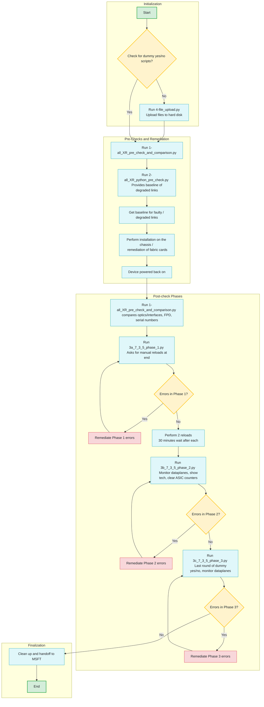

# Process Flowchart

This document outlines the steps and scripts involved in the device commissioning process.

# Process Flowchart

This document outlines the steps and scripts involved in the device commissioning process.

## Script Descriptions

| Script Name                            | Description                                                                                                                                                                                                        |
|:---------------------------------------|:-------------------------------------------------------------------------------------------------------------------------------------------------------------------------------------------------------------------|
| `1-all_XR_pre_check_and_comparison.py` | <ol type="a"><li>Performs CLI pre-check commands.</li><li>Captures baseline for optics / FPD / Serial Number change and comparison after bootup.</li><li>First file captures is considered the baseline.</li></ol> |
| `2-all_XR_python_pre_check.py`         | Provides a baseline of degraded links.                                                                                                                                                                             |
| `3a_7_3_5_phase_1.py`                  | <ol type="a"><li>Monitor dummy yes.</li><li>Monitor dataplane.</li><li>Wait 20 minutes.</li><li>Monitor dummy no.</li><li>Asks to perform the two reloads at the end.</li></ol>                                    |
| `3b_7_3_5_phase_2.py`                  | <ol type="a"><li>Monitoring dataplane.</li><li>Wait 20 minutes.</li><li>Monitor dataplane.</li><li>Wait 20 minutes.</li><li>Show tech file.</li><li>ASIC counters clearing.</li></ol>                              |
| `3c_7_3_5_phase_3.py`                  | <ol type="a"><li>Monitor dummy yes.</li><li>Monitor dataplane.</li><li>Wait 20 minutes.</li><li>Monitor dummy no.</li><li>Monitor dataplane.</li><li>Wait 20 minutes.</li><li>Monitor dummy no.</li></ol>          |
| `4-file_upload.py`                     | Uploads the monitorxx.xx.py files to the device's hard disk.                                                                                                                                                       |

## Process Flow
