# ⚙️ Steps for IOS-XR version 7.3.5

Use the following sequence of steps for any Cisco 8818 and 8808 running IOS-XR version 7.3.5.

## 📝 Table of Contents
1. [Scripts Functionality](#-scripts-functionality)
2. [Process Flow and Steps to Follow](#-process-flow-and--steps-to-follow)
3. [CLI Samples for All Scripts](#-cli-samples-for-all-scripts)
4. [Execution Times](#️-execution-times)
5. [Support](#-support)

---

### 💡 Scripts Functionality

| **Script Name** | **Functionality** |
|:----------------|:------------------|
| **`step_01_02_combined_all_xr_pre_checks_interactive_v3_0.py`** | **CLI & Python Pre-Checks (Interactive)**<br>• **Automatic monitor file upload** (checks if files exist first)<br>• Comprehensive CLI health checks (platform, fabric, NPU, etc.)<br>• Baseline comparison for hardware changes<br>• Two-phase Python script validation for link degradation |
| **`step_03_combined_7_3_5_interactive_v3_0.py`** | **Interactive Post-Check Framework for 7.3.5**<br>• **Combines all post-check phases** into a single interactive menu.<br>• **Phase 1 (Steps a-e):** Initial validation and manual reload guidance.<br>• **Phase 2 (Steps f-j):** Post-reload validation and diagnostics collection.<br>• **Phase 3 (Steps k-q):** Final dual validation for production readiness.<br>• Includes all dataplane monitoring, dummy script runs, and show tech collection. |
| **`utils_7_3_5_common.py`** | **Shared Utilities Library**<br>• Provides common functions for SSH, logging, error handling, and command execution used by the post-check script. Not executed directly. |

---

### 🗺️ Process Flow and 🚀 Steps to Follow

The workflow is now streamlined, with the post-check process managed by a single interactive script.

```mermaid
graph TD
    subgraph "Pre-checks"
        A["🏁 Start"] --> D["⚙️ Run step_01_02...py<br>Select 'Execute All Pre-Checks'"];
    end

    subgraph "Installation (Manual Actions)"
        D --> F["⚡ Power off device"];
        F --> G["🛠️ Install new hardware"];
        G --> H["⚡ Power on device"];
    end

    subgraph "Post-checks"
        H --> P1["⚙️ Run Post-Check Script: Option 1 (Phase 1)"];
        P1 --> P1_Check{"✅ Phase 1 OK?"};
        P1_Check -- No --> P1_Fix["🔧 Diagnose & Fix<br>Re-run Phase 1"];
        P1_Fix --> P1;
        
        P1_Check -- Yes --> R["🔄 Perform Two Reloads<br>Wait 30 mins after each"];
        
        R --> P2["⚙️ Run Post-Check Script: Option 2 (Phase 2)"];
        P2 --> P2_Check{"✅ Phase 2 OK?"};
        P2_Check -- No --> P2_Fix["🔧 Diagnose & Fix<br>Re-run Phase 2"];
        P2_Fix --> P2;

        P2_Check -- Yes --> P3["⚙️ Run Post-Check Script: Option 3 (Phase 3)"];
        P3 --> P3_Check{"🏆 All Post-Checks OK?"};
        P3_Check -- No --> P3_Fix["🔧 Diagnose & Fix<br>Re-run Phase 3"];
        P3_Fix --> P3;

        P3_Check -- Yes --> FHO["🎉 Clean up & Prepare Handoff"];
        FHO --> Q["🏁 End"];
    end

    %% Styling
    style A fill:#D4EDDA,stroke:#28A745,stroke-width:3px,color:#212529
    style Q fill:#D4EDDA,stroke:#28A745,stroke-width:3px,color:#212529
    style P1_Check fill:#FFF3CD,stroke:#FFC107,stroke-width:2px,color:#212529
    style P2_Check fill:#FFF3CD,stroke:#FFC107,stroke-width:2px,color:#212529
    style P3_Check fill:#FFF3CD,stroke:#FFC107,stroke-width:2px,color:#212529
    style FHO fill:#D1ECF1,stroke:#17A2B8,stroke-width:2px,color:#212529
```


---

### 💻 CLI Samples for All Scripts

1. **Run Pre-Checks (Interactive Script)**
```bash
$ python3 step_01_02_combined_all_xr_pre_checks_interactive_v3_0.py

================================================================================
           IOS-XR Universal Pre-Check Interactive Framework v3.0
================================================================================
Enter Router IP address or Hostname: 10.0.0.1
# ... Follow prompts and select option [4] to run all pre-checks
```

2. **Run Post-Checks (Interactive Script for 7.3.5)**
```bash
$ python3 step_03_combined_7_3_5_interactive_v3_0.py

================================================================================
           IOS-XR 7.3.5 Fabric Card Remediation Framework
         Combined Interactive Post-Check Automation v3.0
================================================================================
Enter Router IP address or Hostname: 10.0.0.1
# ... Follow prompts to execute Phase 1, 2, and 3 sequentially
```

---

### ⏱️ Execution Times

| Script Name | Typical Duration | Purpose |
|:----------------|:------------------:|:---------------------------------------------------|
| **Pre-Check Script** | **~77 minutes** | Complete health assessment and link degradation baseline. |
| **Post-Check Script** | **~4.5 hours** | Complete interactive post-check workflow (all phases). |

---

### 📞 Support
- **Author**: Pronoy Dasgupta (prongupt@cisco.com)
- **Version**: 2.0.0
- **Status**: Production Ready

---

**🚀 Ready to automate your Cisco IOS-XR device commissioning process!**