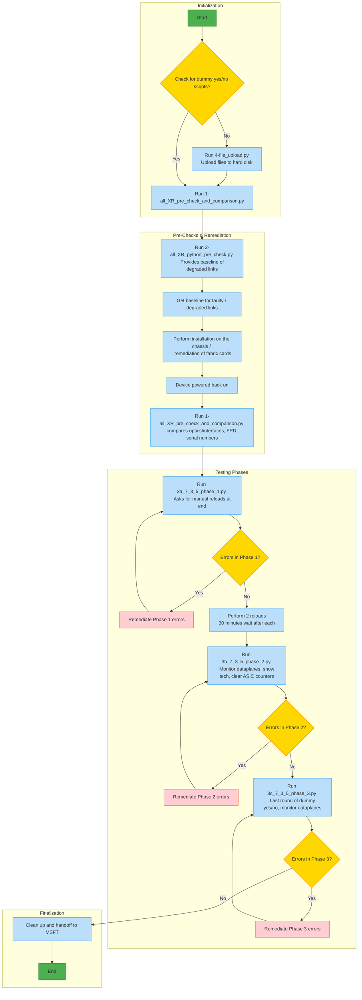

```mermaid
graph TD
    %% Mermaid configuration (optional, might not affect all renderers like GitHub)
    %%{init: {'flowchart': {'htmlLabels': true}}}%%

    subgraph Initialization
        A[Start] --> B{Check for dummy yes/no scripts?};
        B -- No --> C[Run 4-file_upload.py <br> Upload files to hard disk];
        C --> D[Run 1-all_XR_pre_check_and_comparison.py];
        B -- Yes --> D;
    end

    subgraph Pre-Checks & Remediation
        D --> E[Run 2-all_XR_python_pre_check.py <br> Provides baseline of degraded links];
        E --> F[Get baseline for faulty / degraded links];
        F --> G[Perform installation on the chassis / <br> remediation of fabric cards];
        G --> H[Device powered back on];
        H --> I[Run 1-all_XR_pre_check_and_comparison.py <br> compares optics/interfaces, FPD, serial numbers];
    end

    subgraph Testing Phases
        I --> J[Run 3a_7_3_5_phase_1.py <br> Asks for manual reloads at end];
        J --> K{Errors in Phase 1?};
        K -- Yes --> L[Remediate Phase 1 errors];
        L --> J;
        K -- No --> M[Perform 2 reloads <br> 30 minutes wait after each];

        M --> N[Run 3b_7_3_5_phase_2.py <br> Monitor dataplanes, show tech, clear ASIC counters];
        N --> O{Errors in Phase 2?};
        O -- Yes --> P[Remediate Phase 2 errors];
        P --> N;
        O -- No --> Q[Run 3c_7_3_5_phase_3.py <br> Last round of dummy yes/no, monitor dataplanes];

        Q --> R{Errors in Phase 3?};
        R -- Yes --> S[Remediate Phase 3 errors];
        S --> Q;
    end

    subgraph Finalization
        R -- No --> T[Clean up and handoff to MSFT];
        T --> U[End];
    end

    %% Brighter and prettier styling
    style A fill:#4CAF50,stroke:#388E3C,stroke-width:2px,color:#FFFFFF; %% Vibrant Green Start
    style U fill:#4CAF50,stroke:#388E3C,stroke-width:2px,color:#FFFFFF; %% Vibrant Green End
    style B fill:#FFD700,stroke:#FFA000,stroke-width:2px,color:#333333; %% Bright Gold Decision
    style K fill:#FFD700,stroke:#FFA000,stroke-width:2px,color:#333333; %% Bright Gold Decision
    style O fill:#FFD700,stroke:#FFA000,stroke-width:2px,color:#333333; %% Bright Gold Decision
    style R fill:#FFD700,stroke:#FFA000,stroke-width:2px,color:#333333; %% Bright Gold Decision

    style C fill:#BBDEFB,stroke:#2196F3,stroke-width:1px,color:#1A237E; %% Light Blue Action
    style D fill:#BBDEFB,stroke:#2196F3,stroke-width:1px,color:#1A237E; %% Light Blue Action
    style E fill:#BBDEFB,stroke:#2196F3,stroke-width:1px,color:#1A237E; %% Light Blue Action
    style F fill:#BBDEFB,stroke:#2196F3,stroke-width:1px,color:#1A237E; %% Light Blue Action
    style G fill:#BBDEFB,stroke:#2196F3,stroke-width:1px,color:#1A237E; %% Light Blue Action
    style H fill:#BBDEFB,stroke:#2196F3,stroke-width:1px,color:#1A237E; %% Light Blue Action
    style I fill:#BBDEFB,stroke:#2196F3,stroke-width:1px,color:#1A237E; %% Light Blue Action
    style J fill:#BBDEFB,stroke:#2196F3,stroke-width:1px,color:#1A237E; %% Light Blue Action
    style M fill:#BBDEFB,stroke:#2196F3,stroke-width:1px,color:#1A237E; %% Light Blue Action
    style N fill:#BBDEFB,stroke:#2196F3,stroke-width:1px,color:#1A237E; %% Light Blue Action
    style Q fill:#BBDEFB,stroke:#2196F3,stroke-width:1px,color:#1A237E; %% Light Blue Action
    style T fill:#BBDEFB,stroke:#2196F3,stroke-width:1px,color:#1A237E; %% Light Blue Action

    style L fill:#FFCDD2,stroke:#F44336,stroke-width:1px,color:#B71C1C; %% Light Red Remediation
    style P fill:#FFCDD2,stroke:#F44336,stroke-width:1px,color:#B71C1C; %% Light Red Remediation
    style S fill:#FFCDD2,stroke:#F44336,stroke-width:1px,color:#B71C1C; %% Light Red Remediation
```
