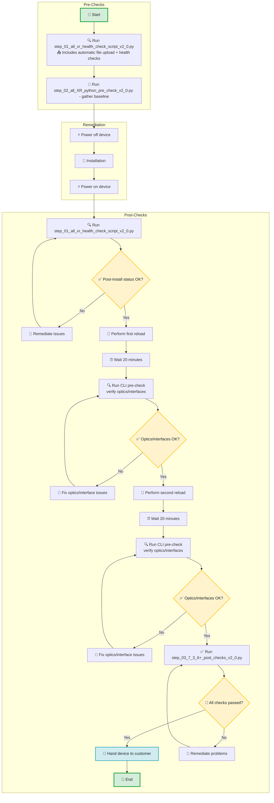

# 🔧 Steps for IOS-XR version 7.3.6 and above

Use the following sequence of steps for any Cisco 8818 and 8808 running IOS-XR version 7.3.6 and above

## 📑 Table of Contents
1. [Scripts Functionality](#-scripts-functionality)
2. [Process Flow and Steps to Follow](#-process-flow-and--steps-to-follow)
3. [CLI Samples for All Scripts](#-cli-samples-for-all-scripts)
4. [Execution Times](#️-execution-times)
5. [Support](#-support)

---

### 📋 Scripts Functionality

| **Script Name** | **Functionality** |
|:----------------|:------------------|
| **step_01** | **CLI Health Checks + File Upload**<br>• **Automatic monitor file upload** (checks if files exist first)<br>• Platform status and serial numbers verification<br>• Fabric reachability assessment<br>• NPU link information and statistics check<br>• ASIC errors detection<br>• Interface status monitoring<br>• Active alarms verification<br>• Fan tray status and field notice compliance<br>• Environment monitoring (temperature, voltage, power)<br>• Baseline comparison for optics/hardware changes |
| **step_02** | **Python Pre-Checks**<br>• Phase 1: Execute dummy scripts with '--dummy' yes<br>• 20-minute countdown timer<br>• Phase 2: Execute dummy scripts with '--dummy' no<br>• Link degradation analysis and baseline establishment<br>• Error detection and reporting for faulty links |
| **step_03** | **Post-Checks for 7.3.6+ (8-Step Workflow)**<br>• Step 1: Execute dummy scripts '--dummy' yes<br>• Step 2: First dataplane monitor (polling mode)<br>• Step 3: 15-minute countdown<br>• Step 4: Execute dummy scripts '--dummy' no (Phase 2)<br>• Step 5: Second dataplane monitor<br>• Step 6: Concurrent countdown + show tech collection<br>• Step 7: Execute dummy scripts '--dummy' no (Phase 3)<br>• Step 8: ASIC error clearing |

---

### 📊 Process Flow and 🚀 Steps to Follow


---


### 💻 CLI Samples for All Scripts

1. **Run CLI Pre-Check + File Upload (if needed)**
```bash
# Example from Part I (CLI Pre-Check + Automatic File Upload)
$ python3 step_01_all_xr_health_check_script_v2_0.py

📁 Monitor files detected on device: group0.py, group1.py, group2.py, group3.py
✅ Files already on hard drive...skipping upload
Sending 'show platform' ('show platform')...
Sending 'show controllers npu all' ('show controllers npu all')...  
✅ CLI health check with integrated file upload completed successfully
```

2. **Run Python Pre-Check (step02)**
```bash
# Example from Part II (Python Pre-Check)
$ python3 step_02_all_XR_python_pre_check_v2_0.py

Phase 1: Execute dummy scripts with '--dummy' yes
Phase 2: Execute dummy scripts with '--dummy' no
✅ Python script validation completed successfully
```

3. **Run Post-Checks (step03)**
```bash
# Example from Part III (Post-Check 7.3.6+)
$ python3 step_03_7_3_6+_post_checks_v2_0.py

Step 1: Phase 1 - Execute dummy scripts '--dummy' yes
Step 2: First Dataplane Monitor (7.3.6+ polling mode)
Step 3: Sequential 15-minute countdown
Step 4: Phase 2 - Execute dummy scripts '--dummy' no
Step 5: Second Dataplane Monitor (7.3.6+ polling mode)
Step 6: Concurrent countdown + show tech collection
Step 7: Phase 3 - Execute dummy scripts '--dummy' no
Step 8: ASIC Error Clearing Command
✅ 8-step post-check workflow completed successfully
```

---   

### ⏱️ Execution Times

| Script           | Typical Duration  | Purpose                                                  |
|------------------|-------------------|----------------------------------------------------------|
| Pre-Check        | **10-15 minutes** | Device health assessment + monitor file management       |
| Python Pre-Check | **45-60 minutes** | Script validation (includes 20min wait)                  |
| Post-Check       | **2-3 hours**     | Comprehensive validation (includes dataplane monitoring) |

---

### 📞 Support
- **Author**: Pronoy Dasgupta (prongupt@cisco.com)
- **Version**: 2.0.0
- **Status**: Production Ready

---

**🚀 Ready to automate your Cisco IOS-XR device commissioning process!**

