# ⚙️ Steps for IOS-XR version 7.3.6 and above

Use the following sequence of steps for any Cisco 8800 series chassis running IOS-XR version 7.3.6 and above.

## 📝 Table of Contents
1. [Scripts Functionality](#-scripts-functionality)
2. [Process Flow and Steps to Follow](#-process-flow-and--steps-to-follow)
3. [CLI Samples for All Scripts](#-cli-samples-for-all-scripts)
4. [Execution Times](#️-execution-times)
5. [Support](#-support)

---

### 💡 Scripts Functionality

| **Script Name** | **Functionality** |
|:----------------|:------------------|
| **`step_01_02_combined_all_xr_pre_checks_interactive_v3_0.py`** | **Universal Pre-Checks (Interactive)**<br>• Combines CLI health checks and Python pre-checks into one script.<br>• **Automatic monitor file upload** (checks if files exist first).<br>• Comprehensive CLI health checks (platform, fabric, NPU, etc.).<br>• Baseline comparison for hardware changes.<br>• Two-phase Python script validation for link degradation. |
| **`step_03_7_3_6+_interactive_v3_0.py`** | **Interactive Post-Check Framework for 7.3.6+**<br>• **Primary Option:** Executes the full, linear 8-step post-check workflow, which aborts on critical failures.<br>• **Diagnostic Options:** Allows for standalone execution of `monitor dataplane` or dummy scripts for targeted troubleshooting.<br>• Contains all logic for log-polling, concurrent operations, and error validation. |

---

### 🗺️ Process Flow and 🚀 Steps to Follow

The workflow is now a streamlined two-script process, simplifying the pre-check and post-check stages.

```mermaid
graph TD
    subgraph "Pre-checks"
        A["🏁 Start"] --> D["⚙️ Run Pre-Check Script<br>step_01_02...py<br>Select 'Execute All Pre-Checks'"];
    end

    subgraph "Installation (Manual Actions)"
        D --> F["⚡ Power off device"];
        F --> G["🛠️ Install new hardware"];
        G --> H["⚡ Power on device"];
    end

    subgraph "Post-checks"
        H --> J_node["⚙️ Run Pre-Check Script again<br>Select 'CLI Pre-Checks Only' to verify hardware"];
        J_node --> K{"✅ Hardware & interfaces OK?"};
        K -- No --> K_Remediate_Step["🔧 Remediate issues & re-verify"];
        K_Remediate_Step --> J_node;
        
        K -- Yes --> M["⚙️ Run Post-Check Script (7.3.6+)<br>step_03_7_3_6+...py<br>Select 'Execute Full 8-Step Workflow'"];
        M --> N{"🏆 Workflow Passed?"};
        N -- Yes --> P["🎉 Clean up & Prepare Handoff"];
        N -- No --> O["🔧 Use diagnostic options to fix<br>Re-run full workflow"];
        O --> M;
        
        P --> Q["🏁 End"];
    end

    %% Styling
    style A fill:#D4EDDA,stroke:#28A745,stroke-width:3px,color:#212529
    style Q fill:#D4EDDA,stroke:#28A745,stroke-width:3px,color:#212529
    style K fill:#FFF3CD,stroke:#FFC107,stroke-width:2px,color:#212529
    style N fill:#FFF3CD,stroke:#FFC107,stroke-width:2px,color:#212529
    style P fill:#D1ECF1,stroke:#17A2B8,stroke-width:2px,color:#212529
```


---


### 💻 CLI Samples for All Scripts

1. **Run CLI Pre-Check + File Upload (if needed)**
```bash
# Example from Part I (CLI Pre-Check + Automatic File Upload)
$ python3 step_01_all_xr_health_check_script_v2_0.py

📁 Monitor files detected on device: group0.py, group1.py, group2.py, group3.py
✅ Files already on hard drive...skipping upload
Sending 'show platform' ('show platform')...
Sending 'show controllers npu all' ('show controllers npu all')...  
✅ CLI health check with integrated file upload completed successfully
```

2. **Run Python Pre-Check (step02)**
```bash
$ python3 step_03_7_3_6+_interactive_v3_0.py

================================================================================
           IOS-XR 7.3.6+ Post-Check Interactive Framework v3.0
================================================================================
Enter Router IP address or Hostname: 10.0.0.1
# ... Select option [1] to run the full workflow ...

# The script will now execute the 8-step post-check process:
Step a: Phase 1 - Execute dummy scripts '--dummy' yes
Step b: First Dataplane Monitor (7.3.6+ polling mode)
Step c: Sequential 15-minute countdown
Step d: Phase 2 - Execute dummy scripts '--dummy' no
Step e: Second Dataplane Monitor (7.3.6+ polling mode)
Step f: Concurrent countdown + show tech collection
Step g: Phase 3 - Execute dummy scripts '--dummy' no
Step h: ASIC Error Clearing Command
✅ 8-step post-check workflow completed successfully.
```

---   

### ⏱️ Execution Times

| Script                | Typical Duration | Purpose                                                  |
|-----------------------|-----------------|----------------------------------------------------------|
| **Pre-Check Script**  | **80 minutes**  | Device health assessment + monitor file management       |
| **Post-Check Script** | **2 hours**     | Comprehensive validation (includes dataplane monitoring) |

### ⏱️ Execution Times

| Script Name | Typical Duration | Purpose |
|:----------------|:----------------:|:---------------------------------------------------|
| **Pre-Check Script** | **~77 minutes**  | Complete health assessment and link degradation baseline. |
| **Post-Check Script** |   **~2 hours**   | Complete interactive post-check workflow (all phases). |
---

### 📞 Support
- **Author**: Pronoy Dasgupta (prongupt@cisco.com)
- **Version**: 2.0.0
- **Status**: Production Ready

---

**🚀 Ready to automate your Cisco IOS-XR device commissioning process!**

