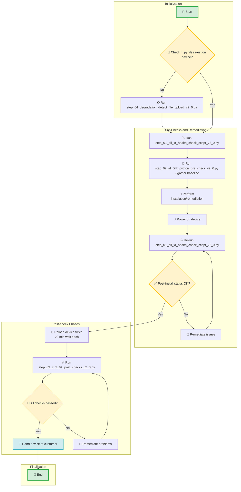

# 🔧 Cisco 8000 IOS-XR Fabric Health Remediation Automation Suite

A comprehensive Python automation toolkit for commissioning and validating Cisco IOS-XR devices (8804, 8808, 8812, 8818). This suite performs health checks, baseline establishment, script validation, and comprehensive post-commissioning verification.

## 🚀 Quick Overview

This automation suite guides you through the complete device commissioning process with **4 simple scripts** that run in sequence:

### 📋 What Each Script Does

| **Script** | **Purpose** | **What It Does** |
|------------|-------------|------------------|
| **1** - `step_01_all_xr_health_check_script_v2_0.py` | 🔍 **CLI Pre-Check** | • Performs comprehensive device health checks<br>• Captures baseline for optics/FPD/serial numbers<br>• **First run creates the baseline for all future comparisons** |
| **2** - `step_02_all_XR_python_pre_check_v2_0.py` | 🐍 **Python Script Validation** | • Provides baseline of degraded links<br>• Validates Python script execution capability<br>• Two-phase dummy script testing |
| **3** - `step_03_7_3_6+_post_checks_v2_0.py` | ✅ **Post-Installation Verification** | • Monitors dummy scripts and dataplane health<br>• Performs comprehensive 8-step validation workflow<br>• Captures show tech and clears ASIC counters |
| **4** - `step_04_degradation_detect_file_upload_v2_0.py` | 📤 **File Upload Utility** | • Uploads monitor scripts to device hard disk<br>• **Run this first if monitor files don't exist on device** |

## 📊 Process Flow


## 🎯 Quick Start

### Prerequisites
- **Python 3.7+** (auto-setup included for dependencies)
- **Network access** to target Cisco IOS-XR devices
- **SSH credentials** for device access

### Basic Usage

1. **📤 Upload Files (if needed)**
   ```
   python3 step_04_degradation_detect_file_upload_v2_0.py --hosts router1.example.com --username admin

2. **🔍 Run Pre-Check (Establishes Baseline)**
    ```
   python3 step_01_all_xr_health_check_script_v2_0.py

3. **🐍 Validate Python Scripts**
    ```
    python3 step_02_all_XR_python_pre_check_v2_0.py
   
4. **✅ Post-Installation Verification**
    ```
    python3 step_03_7_3_6+_post_checks_v2_0.py
   

⏱️ Execution Times

Script	Typical Duration	Purpose
Pre-Check	10-15 minutes	Device health assessment
Python Pre-Check	45-60 minutes	Script validation (includes 20min wait)
Post-Check	2-3 hours	Comprehensive validation (includes dataplane monitoring)
File Upload	2-5 minutes	File transfer utility