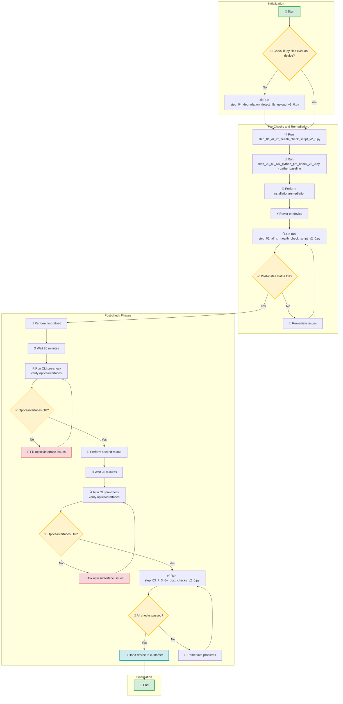

# 🔧 Cisco 8000 IOS-XR Fabric Health Remediation Automation Suite

A comprehensive Python automation toolkit for commissioning and validating Cisco IOS-XR devices (8804, 8808, 8812, 8818). This suite performs health checks, baseline establishment, script validation, and comprehensive post-commissioning verification.

## 🚀 Quick Overview

This automation suite guides you through the complete device commissioning process with **4 simple scripts** that run in sequence:

### 📋 What Each Script Does

| **Script**                                               | **Purpose**                          | **What It Does**                                                                                                                                                      |
|----------------------------------------------------------|--------------------------------------|-----------------------------------------------------------------------------------------------------------------------------------------------------------------------|
| **1** - `step_01_all_xr_health_check_script_v2_0.py`     | 🔍 **CLI Pre-Check**                 | • Performs comprehensive device health checks<br>• Captures baseline for optics/FPD/serial numbers<br>• **First run creates the baseline for all future comparisons** |
| **2** - `step_02_all_XR_python_pre_check_v2_0.py`        | 🐍 **Python Script Validation**      | • Provides baseline of degraded links<br>• Validates Python script execution capability<br>• Two-phase dummy script testing                                           |
| **3** - `step_03_7_3_6+_post_checks_v2_0.py`             | ✅ **Post-Installation Verification** | • Monitors dummy scripts and dataplane health<br>• Performs comprehensive 8-step validation workflow<br>• Captures show tech and clears ASIC counters                 |
| **4** - `step_04_degradation_detect_file_upload_v2_0.py` | 📤 **File Upload Utility**           | • Uploads monitor scripts to device hard disk<br>• **Run this first if monitor files don't exist on device**                                                          |

## 📊 Process Flow


## 🎯 Quick Start

### Prerequisites
- **Python 3.7+** (auto-setup included for dependencies)
- **Network access** to target Cisco IOS-XR devices
- **SSH credentials** for device access

### Basic Usage

1. **📤 Upload Files (if needed)**
   ```
   python3 step_04_degradation_detect_file_upload_v2_0.py --hosts router1.example.com --username admin

2. **🔍 Run Pre-Check (Establishes Baseline)**
    ```
   python3 step_01_all_xr_health_check_script_v2_0.py

3. **🐍 Validate Python Scripts**
    ```
    python3 step_02_all_XR_python_pre_check_v2_0.py
   
4. **✅ Post-Installation Verification**
    ```
    python3 step_03_7_3_6+_post_checks_v2_0.py
   

## ⏱️ Execution Times

| Script           | Typical Duration  | Purpose                                                  |
|------------------|-------------------|----------------------------------------------------------|
| Pre-Check        | **10-15 minutes** | Device health assessment                                 |
| Python Pre-Check | **45-60 minutes** | Script validation (includes 20min wait)                  |
| Post-Check       | **2-3 hours**     | Comprehensive validation (includes dataplane monitoring) |
| File Upload      | **2-5 minutes**   | File transfer utility                                    |

## 🎨 Features

### ✨ **Smart & Reliable**
- 🔄 **Auto-retry SSH connections** for problematic devices
- 🌐 **Cross-platform compatibility** with automatic environment setup
- 📊 **Progress tracking** with real-time status updates
- 🎯 **Detailed error analysis** with intuitive reporting

### 📁 **Organized Output**
- 📂 **Hostname-based directories** for organized file storage
- 📝 **Session logs** for troubleshooting and audit trails
- 📄 **Raw output files** with complete command responses
- ⏰ **Execution time tracking** for performance monitoring

### 🛡️ **Production Ready**
- 🔧 **Graceful error handling** with informative messages
- 🎨 **Color-coded status indicators** for quick visual feedback
- 📊 **Comprehensive final summaries** with execution statistics
- 🔍 **Detailed consistency verification** across all components

## 📖 Getting Help

### 🆘 Common Issues
- **SSH Connection Problems**: Scripts include automatic retry with progressive delays
- **Missing Dependencies**: Auto-setup creates isolated environments when possible
- **Permission Issues**: Clear error messages with specific solution commands

### 📞 Support
- **Author**: Pronoy Dasgupta (prongupt@cisco.com)
- **Version**: 2.0.0
- **Status**: Production Ready

## 🔍 Feature Compatibility Matrix

| **Feature**                       | **Part I<br>Pre-Check** | **Part II<br>Python Pre-Check** | **Part III<br>Post-Check** |
|-----------------------------------|:-----------------------:|:-------------------------------:|:--------------------------:|
| **Cross-Platform Venv Setup**     |            ✅            |                ✅                |             ✅              |
| **Enhanced SSH Retry (3x)**       |            ✅            |                ✅                |             ✅              |
| **Progressive Connection Delays** |            ✅            |                ✅                |             ✅              |
| **Problem Router Support**        |            ✅            |                ✅                |             ✅              |
| **Enhanced Command Format**       |            ✅            |                ✅                |             ✅              |
| **Terminal Length/Width Setup**   |            ✅            |                ✅                |             ✅              |
| **Full Hostname Preservation**    |            ✅            |                ✅                |             ✅              |
| **Progress Bar Tracking**         |            ✅            |                ❌                |             ❌              |
| **Colored Logging (✓/✗)**         |            ✅            |                ✅                |             ✅              |
| **Complete Timestamps**           |            ✅            |                ✅                |             ✅              |
| **Output Coordination (Tee)**     |            ✅            |                ✅                |             ✅              |
| **Manual Error Table Widths**     |            ❌            |                ✅                |             ✅              |
| **Detailed Error Values**         |            ❌            |                ✅                |             ✅              |
| **Execution Time Tracking**       |            ✅            |                ✅                |             ✅              |
| **Final Summary Tables**          |            ✅            |                ✅                |             ✅              |
| **Center-Aligned Test Numbers**   |            ✅            |                ✅                |             ✅              |
| **Color-Coded Status**            |            ✅            |                ✅                |             ✅              |
| **Fail-Fast Error Handling**      |            ❌            |                ❌                |             ✅              |
| **Global Error Tracking**         |            ❌            |                ✅                |             ✅              |
| **Python 3.7+ Compatibility**     |            ✅            |                ✅                |             ✅              |
| **Fabric/NPU Health Checks**      |            ✅            |                ❌                |             ❌              |
| **Field Notice Compliance**       |            ✅            |                ❌                |             ❌              |
| **Baseline Comparison**           |            ✅            |                ❌                |             ❌              |
| **Link Degradation Analysis**     |            ❌            |                ✅                |             ✅              |
| **Dataplane Monitoring**          |            ❌            |                ❌                |             ✅              |
| **Show Tech Collection**          |            ❌            |                ❌                |             ✅              |
| **ASIC Error Clearing**           |            ❌            |                ❌                |             ✅              |
| **Concurrent Operations**         |            ❌            |                ❌                |             ✅              |
| **Multi-Phase Execution**         |            ❌            |                ✅                |             ✅              |

### 📊 **Summary**
- **Part I**: Comprehensive device health assessment with baseline establishment
- **Part II**: Two-phase Python script validation with error tracking  
- **Part III**: 8-step post-commissioning workflow with advanced monitoring


<sub> Total Compatibility Score: 100% - All parts implement appropriate features for their specific purposes while maintaining consistent patterns for shared functionality. </sub>

---

**🚀 Ready to automate your Cisco IOS-XR device commissioning process!**

