# Process Flowchart

This document outlines the steps and scripts involved in the device commissioning process.

## Script Descriptions

| Script Name                            | Description                                                                                                                                                                                                                                               |
|:---------------------------------------|:----------------------------------------------------------------------------------------------------------------------------------------------------------------------------------------------------------------------------------------------------------|
| `1-all_XR_pre_check_and_comparison.py` | <ol type="a"><li>Performs CLI pre-check commands.</li><li>Captures baseline for optics / FPD / Serial Number change and comparison after bootup.</li><li>First file captures is considered the baseline.</li></ol>                                        |
| `2-all_XR_python_pre_check.py`         | Provides a baseline of degraded links.                                                                                                                                                                                                                    |
| `3-7_3_6+_python_post_checks.py`       | <ol type="a"><li>Monitor dummy yes.</li><li>Monitor dataplane.</li><li>Wait 10 minutes.</li><li>Monitor dummy no.</li><li>Monitor dataplane.</li><li>Wait 15 minutes and capture show tech.</li><li>Monitor dummy.</li><li>ASIC counters clear.</li></ol> |
| `4-file_upload.py`                     | Uploads the monitorxx.xx.py files to the device's hard disk.                                                                                                                                                                                              |

## Process Flow

```mermaid
graph TD
    subgraph Initialization
        A[🏁 Start] --> B{📁 Check if .py files exist on device?};
        B -- No --> C[📤 Run step_04_degradation_detect_file_upload_v2_0.py];
    end

    subgraph Pre-Checks and Remediation
        C --> D[🔍 Run step_01_all_xr_health_check_script_v2_0.py];
        B -- Yes --> D; 
        D --> E[🐍 Run step_02_all_XR_python_pre_check_v2_0.py - gather baseline];
        E --> F[🔧 Perform installation/remediation];
        F --> I[⚡ Power on device];
        J_node[🔍 Re-run step_01_all_xr_health_check_script_v2_0.py];
        I --> J_node;
        J_node --> K{✅ Post-install status OK?};
        K -- No --> K_Remediate_Step[🔧 Remediate issues];
        K_Remediate_Step --> J_node;
    end

    subgraph Post-check Phases
        K -- Yes --> L[🔄 Reload device twice<br>20 min wait each];
        L --> M[✅ Run step_03_7_3_6+_post_checks_v2_0.py];
        M --> N{🎯 All checks passed?};
        N -- Yes --> P[🎉 Hand device to customer];
        N -- No --> O[🔧 Remediate problems];
        O --> M;
    end
    
    subgraph Finalization
        P --> Q[🏁 End];
    end

    %% Styling
    style A fill:#D4EDDA,stroke:#28A745,stroke-width:3px,color:#212529
    style Q fill:#D4EDDA,stroke:#28A745,stroke-width:3px,color:#212529
    style B fill:#FFF3CD,stroke:#FFC107,stroke-width:2px,color:#212529
    style K fill:#FFF3CD,stroke:#FFC107,stroke-width:2px,color:#212529
    style N fill:#FFF3CD,stroke:#FFC107,stroke-width:2px,color:#212529
    style P fill:#D1ECF1,stroke:#17A2B8,stroke-width:2px,color:#212529
```

